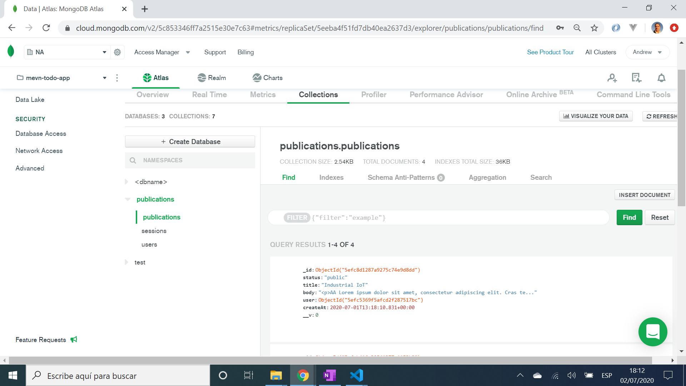

# :zap: MEHN Stack Published

* This app displays publications for multiple authors in Bootstrap cards. It uses the MongoDB, Express, Handlebars & Node.js (MEHN) stack to perform Create, Read, Update and Delete (CRUD) operations.

**Note:** to open web links in a new window use: _ctrl+click on link_

## :page_facing_up: Table of contents

* [:zap: MEHN Stack Published](#zap-mehn-stack-published)
	* [:page_facing_up: Table of contents](#page_facing_up-table-of-contents)
	* [:books: General info](#books-general-info)
	* [:camera: Screenshots](#camera-screenshots)
	* [:signal_strength: Technologies](#signal_strength-technologies)
	* [:floppy_disk: Setup](#floppy_disk-setup)
	* [:computer: Code Examples](#computer-code-examples)
	* [:cool: Features](#cool-features)
	* [:clipboard: Status & To-Do List](#clipboard-status--to-do-list)
	* [:clap: Inspiration](#clap-inspiration)
	* [:envelope: Contact](#envelope-contact)

## :books: General info

* Login authentication using google auth API
* After authentication dashboard displays list of publications for the person logged in
* Side menu has navigation to all public publications and a logout link
* Public publications page displays everyones publications stored in the MongoDB that have 'public' status

## :camera: Screenshots



## :signal_strength: Technologies

* [Express Handlebars v4](https://www.npmjs.com/package/express-handlebars) view engine for Express
* [Express method-override](http://expressjs.com/en/resources/middleware/method-override.html) to be able to use HTTP verbs PUT or DELETE
* [Bootstrap v4](https://getbootstrap.com/) components and styles
* [font-awesome v5](https://cdnjs.com/libraries/font-awesome) iconic SVG, font, and CSS toolkit
* [Materialize v1](https://materializecss.com/) front-end framework based on Material Design
* [moment v2](https://www.npmjs.com/package/moment) to convert UTC date to a more readable format
* [CKEditor v4](http://cdn.ckeditor.com/) to add a wysiwyg editor for creating/editing publications

* [Express v4](https://expressjs.com/) fromework for Node.js
* [express session v1](https://www.npmjs.com/package/express-session) to save session data
* [Mongoose v5](https://mongoosejs.com/)
* [passport v0.4.1](http://www.passportjs.org/) authentication for Node.js
* [connect-mongo](https://www.npmjs.com/package/connect-mongo) MongoDB session store for Express
* [cors](https://www.npmjs.com/package/cors) Cross Origin Resource Sharing Connect/Express middleware
* [morgan](https://www.npmjs.com/package/morgan) HTTP request logger middleware for node.js

* [cross-env](https://www.npmjs.com/package/cross-env) to run scripts that set and use environment variables across platforms
* [blindtextgenerator Lorem Ipsum](https://www.blindtextgenerator.com/lorem-ipsum) to create text to fill publications cards for testing

## :floppy_disk: Setup

* `npm run dev` to run handlebars client and backend server concurrently. Navigate to `http://localhost:3000/` to see frontend (refresh after changes - does not auto-update).

## :computer: Code Examples

*

```javascript


```

## :cool: Features

* In dev - Front and backends are run with one command
* TO DO: backend code separates Express controller functions from routes
* TO DO: Updating a note will automatically update the date so it goes to the front of the (date-sorted) notes list

## :clipboard: Status & To-Do List

* Status: Mostly working. Refactor  - add controllers and add functionality. Change 'read more' footer to floating buttons?
* To-Do: not seeing css file - fix. Fix CKEDITOR error. replace moment with smaller version. Correct grid of cards to even row height.

## :clap: Inspiration

* [Traversy Media: Node.js App From Scratch | Express, MongoDB & Google OAuth](https://www.youtube.com/watch?v=SBvmnHTQIPY&t=2267s)

## :envelope: Contact

* Repo created by [ABateman](https://www.andrewbateman.org) - you are welcome to [send me a message](https://andrewbateman.org/contact)
